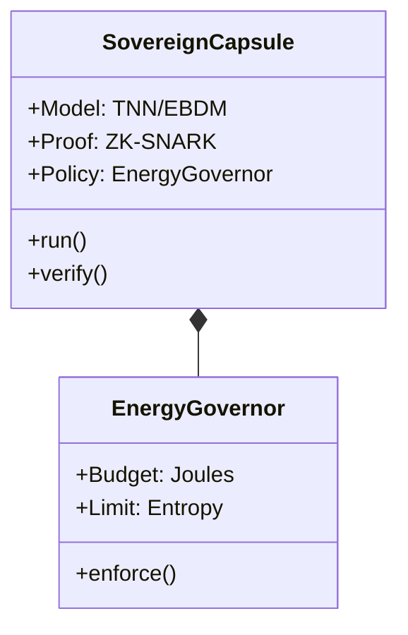

# TMF Architecture Deep Dive
## The Stack That Powers Sovereign Intelligence

### 1. The High-Level Flow

```mermaid
graph TD
    A[Raw Physical Data] -->|Ingest| B(Energy Extraction Layer)
    B -->|E = H(x)| C{Thermodynamic Prior}
    C -->|Conditioning| D[Diffusion Model / TNN]
    D -->|Inference| E[Proposed State]
    E -->|Check| F{Conservation Compiler}
    F -->|Pass| G[Sovereign Capsule]
    F -->|Fail| H[Reject & Penalize]
    G -->|Deploy| I[Industrial Asset]
```

### 2. The Core Components

#### A. Energy Extraction Layer
*   **Input:** Sensor streams (Voltage, Temperature, Flow).
*   **Process:** Computes the instantaneous Hamiltonian $H(q, p)$.
*   **Output:** An "Energy Map" tensor.

#### B. Thermodynamic Prior
*   **Function:** $P(x) \propto e^{-E(x)/kT}$
*   **Role:** Biases the AI's search space towards physically valid states. It acts as a "gravity well" for the model.

#### C. Conservation Compiler (CLC)
*   **Role:** The "Physics Linter".
*   **Logic:**
    *   $\Delta E < \epsilon$ (Energy Conservation)
    *   $\nabla \cdot B = 0$ (Magnetic Flux)
    *   $\sum F = ma$ (Newton's Law)

### 3. The Deployment Unit: Sovereign Capsule



**Why This Wins:**
Competitors deploy "weights". We deploy **Capsules**.
A Capsule contains the model, the physics constraints, the safety budget, and the cryptographic proof of training. It is a complete, sovereign industrial agent.
